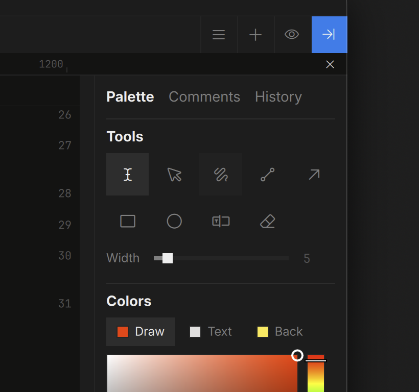
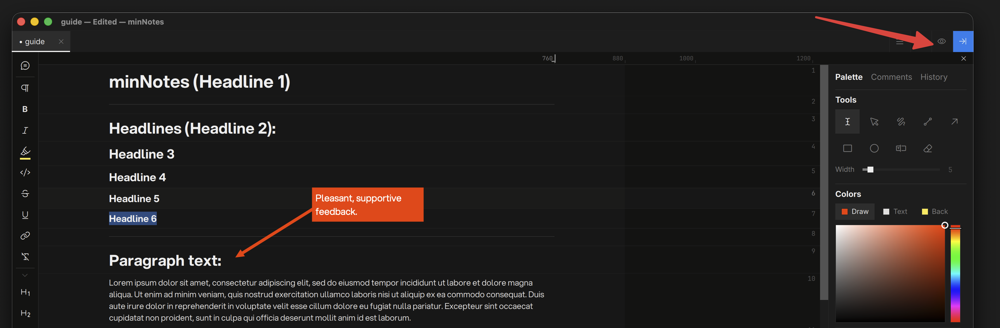
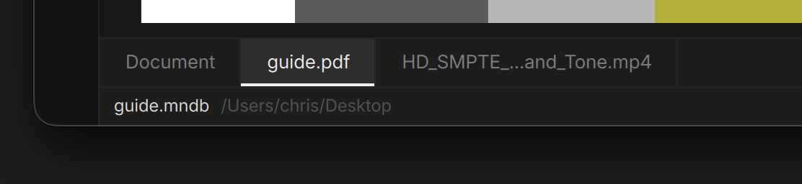
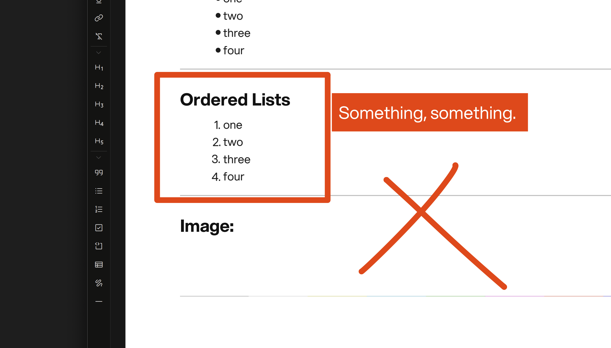
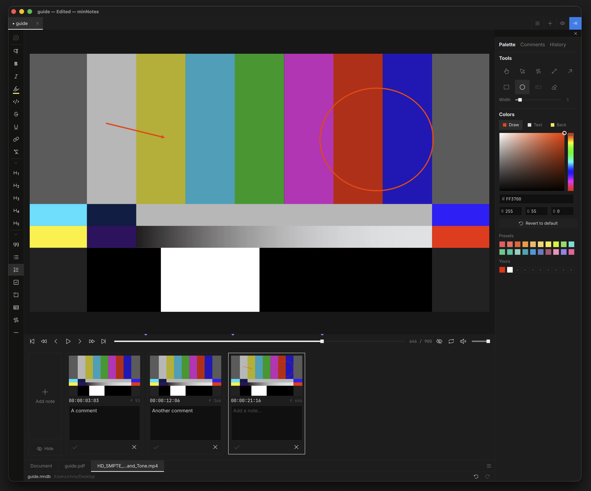
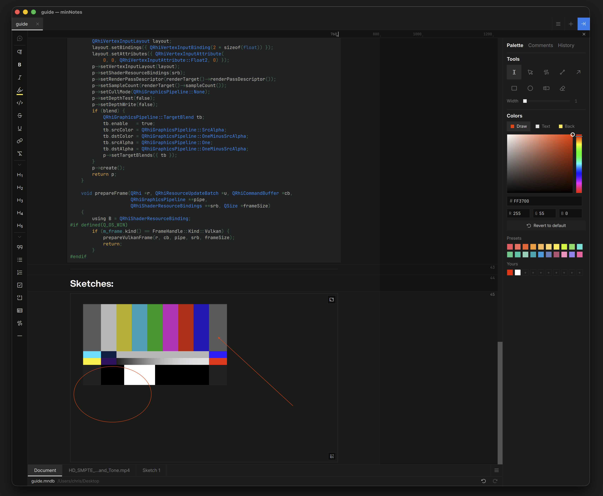
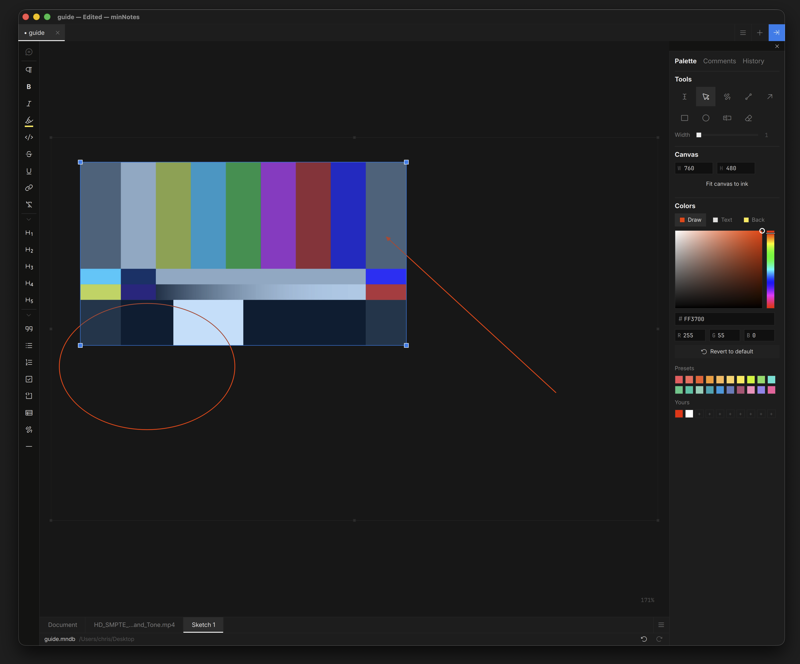

# Drawing & Ink

The Tools grid at the top of the Inspector holds the Type tool
(regular editing, where you always start), Select/Move, and the drawing
tools: freehand, line, arrow, rectangle, oval, text box, eraser.

Pick a tool and draw anywhere — over text, in the margins, on media. Press
`Esc` to drop back to typing.

## On the Page

Ink pins to the block it overlaps, so it stays with its content as the
note changes. Ink in the margins is anchored to the page edges — it keeps
its place beside the text even when you change the page width. Ink on an
image scales with the image.

The **eye** on the tab strip shows or hides the whole ink layer while you
read. Ink exports as toggleable layers in HTML and bakes into images for
Word and PDF exports.

## Select & Move

With **Select/Move**: click an annotation to grab it, drag a rubber band
over several (`Shift+Click` adds or removes one), then drag the group or
press `Delete`. Each gesture is a single undo step.

## Media Block Tabs

Below each note lives a tabbed interface for each media block in your document. **Clicking on a tab** opens the media block in a studio setup where you can annotate and edit special blocks like PDFs, videos, sketches, and tables.

## PDF Pages

Open a PDF full-frame and the drawing tools mark up **the page under the
cursor** — each page keeps its own ink, and the text tool drops text chips
onto pages. Hold **Space** to pan with the hand while a tool is armed.
Page markup shows on the inline preview, travels with the note, and
exports as annotated page images. The PDF file itself is never touched.

## Video

Open a video full-frame for the review studio: scrub with skim audio,
step frames, and draw on any frame. Annotations save to a `.qcview`
sidecar next to the media — **fully interchangeable with QCView**: notes
made in either app open in the other.

| Action | Shortcut |
|---|---|
| Rewind / fast-forward (hold) | `A` / `D` (or `J` / `L`) |
| Cycle review speed (0.5×–2×) | `R` |
| Reset speed | `⇧R` |

## Sketches

Insert a **sketch** block for a blank canvas with a pressure-smoothed pen.
Sketches edit full-frame with pan and zoom, the canvas is resizable in
every direction, and ink is allowed to overflow the frame — pull the
frame out later to reveal it.

