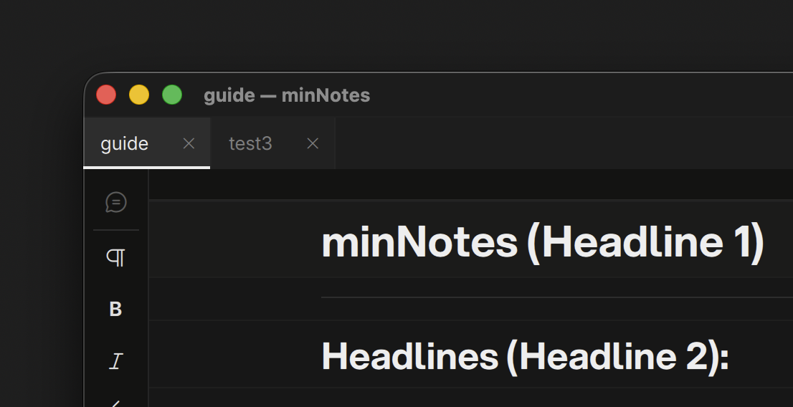
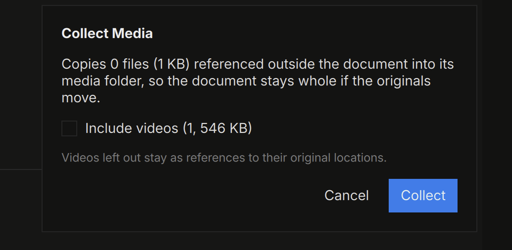

# Documents & Tabs

A note is a single `.mndb` file. Keep it on local disk, a NAS share,
Dropbox, LucidLink — anywhere — and open it from macOS or Windows.

## Tabs

Open several notes at once; each tab is an independent note with its own
undo history. **New** (`⌘N`), **Open** (`⌘O`), **Save As** (`⌘⇧S`), and
**Close** (`⌘W`) live in the File menu. Middle-click a tab to close it;
the list button at the right end of the strip shows every open note by
full name.

A dot on the tab marks unsaved changes (or a never-saved scratch note).
Closing a tab or quitting with unsaved work prompts you first.

## Saving

minNotes edits a fast local working copy of your note and writes back to
the original file when you **Save** (`⌘S`). This keeps notes safe even on
network shares that don't play well with live databases. If the file
changed on disk while you worked (another machine, another person), Save
tells you before overwriting.

## Merging Notes

**Drag a tab onto another tab** to merge one note into another:

1. Hold the dragged tab over the destination tab for a beat — the
   destination opens underneath you.
2. Drag down into the document; a pulsing line shows where the content
   will land between blocks.
3. Drop. The **whole source note** copies in at that spot — text, tables,
   media, comment threads (with their history), and drawn ink all come
   along. The source tab stays open, untouched.

One `⌘Z` undoes the entire merge. Dropping directly on a tab (without
entering the document) appends at the end. Media that lives with the
source note is copied into the destination's media folder; files
referenced from shares stay referenced.

## Save As & Media

**Save As** copies the note and its media folder to the new location. If
media is still referenced from elsewhere (a NAS share, an absolute path),
minNotes offers to **collect** it into the new note so the copy is
self-contained:

Videos are opt-in (they're big). Decline and everything stays linked —
you can collect later with **Document ▸ Collect Media…**. See
[Media](media.md).

## Recent Notes

**File ▸ Open Recent** lists your last ten notes. The welcome screen (no
tabs open) offers the same list, plus drag-and-drop import.
