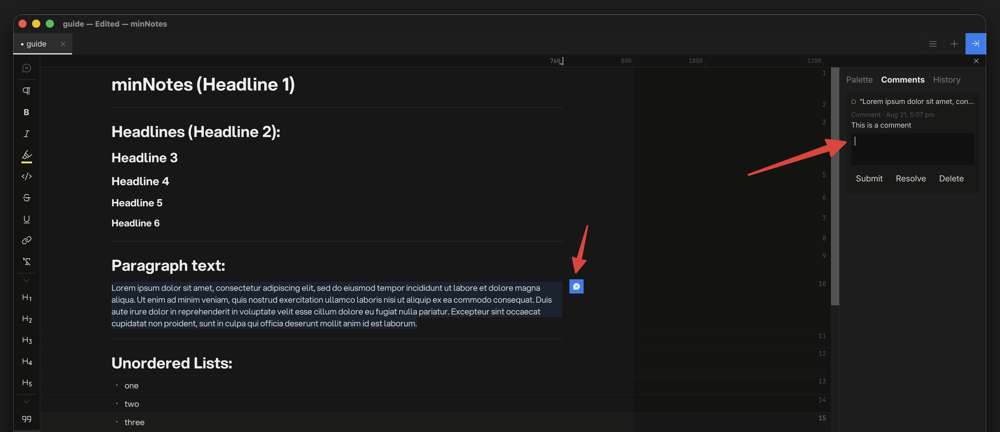
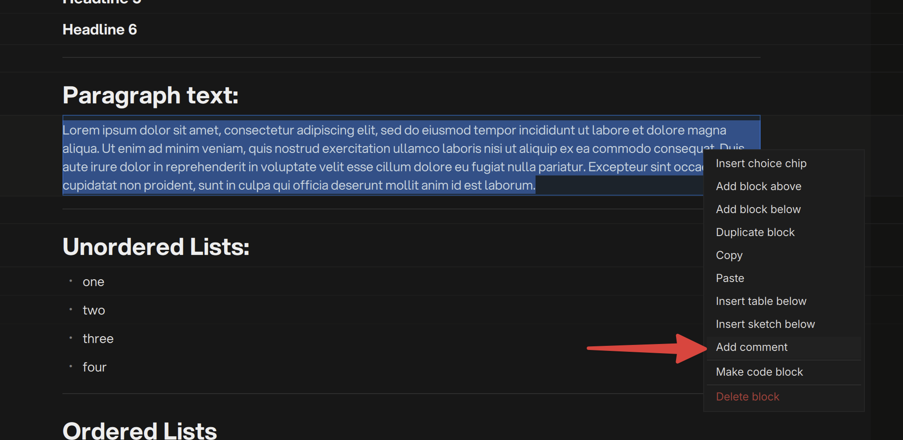

# Comments

Select text in a block and choose **Add comment** from the right-click
menu. The text gets a subtle tint and a blue bubble appears in the margin
— blue means a conversation lives here.

## Threads

Click the bubble to open the thread right there in the margin: read,
reply, **Resolve**. In the composer, `Enter` submits and `Shift+Enter`
starts a new line.

When every thread on a block is resolved, its bubble and tint go quiet
grey — settled conversations stop asking for attention. Reopen a thread
and it comes back blue.

## The Comments View

The Inspector's **Comments** view lists every thread in the note with its
full history — jump to any thread's block, reply, resolve, or delete from
there.

## Comments in Exports

- **HTML** — threads pop up when you hover the commented text (resolved
  ones dim), and a printable list sits at the end of the page.
- **Word** — comments arrive as **native review comments**, anchored to
  the text, ready for replies in Word's own UI.
- **Markdown / PDF** — comments become footnotes with timestamps and
  resolve state.
