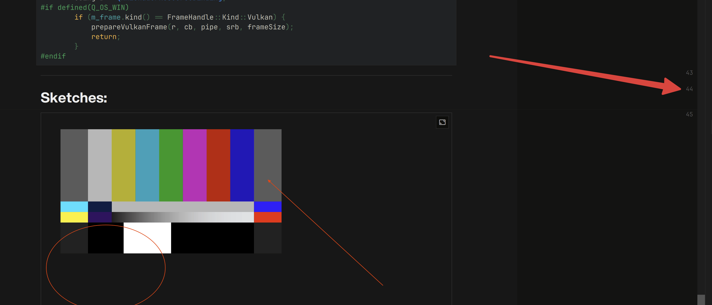
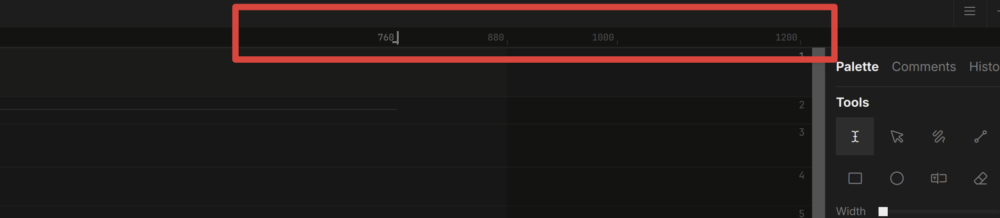
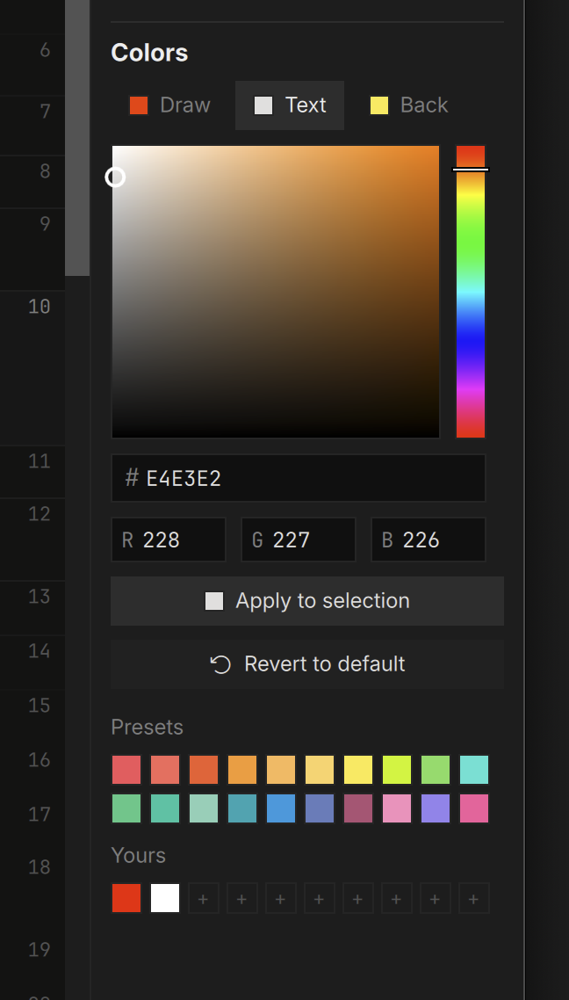
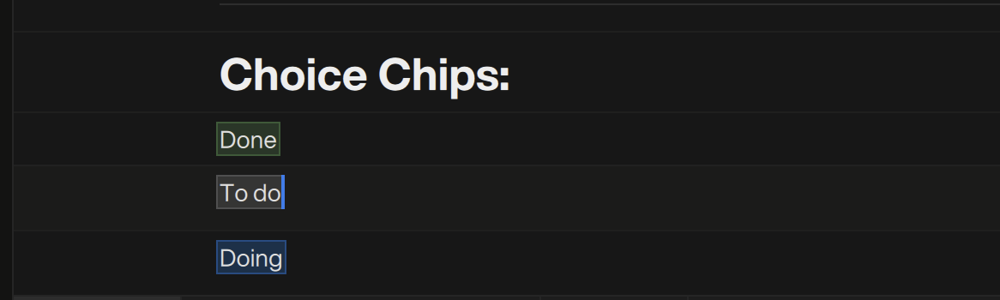
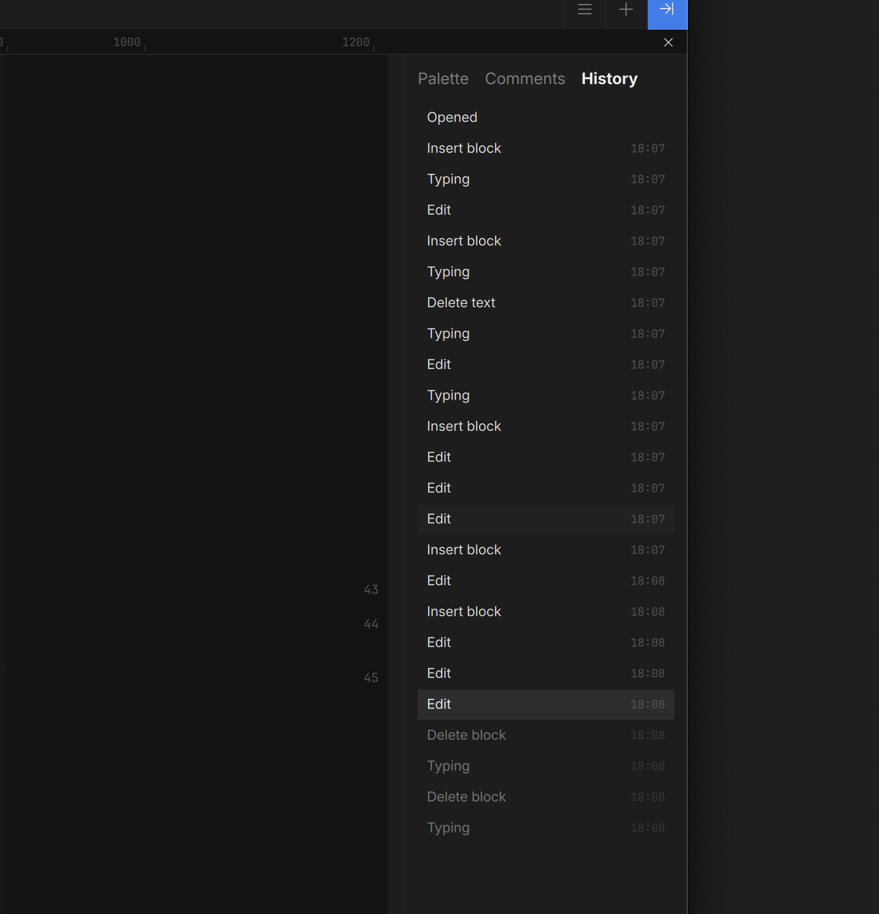

# Editing

A note is a list of **blocks**. Press `Enter` to start a new block,
`Backspace` at the start of an empty block to merge it up. Grab the number to the far right of a block and drag to rearrange blocks.



## Markdown-Style Triggers

Type these at the **start** of a block and it converts as you go:

| Type this | Becomes |
|---|---|
| `# ` … `###### ` | Heading 1–6 |
| `> ` | Quote |
| `- `, `* `, `+ ` | Bullet list item |
| `- [ ] ` / `- [/] ` / `- [x] ` | Task (to-do / doing / done) |
| `1. ` (any number) | Numbered list item |
| ```` ``` ```` or ```` ```lang ```` then `Enter` | Code block (optionally for a language) |
| `---` / `***` / `___` then `Enter` | Divider |

List items nest with `Tab` / `Shift+Tab`.

Every code block carries a small **language chip** in its top-right corner —
click it to pick the syntax highlighting from the full language list (type to
filter). The ```` ```lang ```` fence tag still works if you prefer typing it.

## The Page

The page is a steady reading measure — it never squeezes. A narrow window
scrolls sideways instead of rewrapping your text; a wide table extends past
the page into the margin.

Each note has its **own page width**. The slim ruler above the page shows
the stops (760 up to 1600) — drag the handle or click a stop; the page
reflows live and one Undo puts it back. Margin ink rides along as the page
widens. Pick a wide page for image boards, the classic measure for prose.



Down the right side runs the **block ruler**: every block's number, a
shared address you can reference anywhere ("see block 14" — the numbers
also appear in exports). **Drag a number to reorder its block**; an accent
line shows where it will land.

## Inline Formatting

Select text and use a shortcut or the Inspector — **bold**, *italic*,
`code`, underline, strikethrough, links (`⌘K`). Clear formatting on a
selection with `⌘\`.

### Colors

The Inspector's palette has three tabs: **Draw** (annotations) **Text** (text color) and **Back** (background). Pick a swatch with text selected to color it; with nothing
selected the color arms as a pen for what you type next. The same palette
colors table selections — whole rows and columns included (see
[Tables](tables.md)). **Revert** clears both back to default.



### Choice Chips

`⌥⌘C` inserts an inline **choice chip** — To do / Doing / Done — anywhere
in text, including inside table cells. Click the chip to change its state;
the chip travels with the text through exports.



## Undo & History

Every gesture is one undo step — a bulk table edit, a whole tab merge, a
run of image-resize nudges all take a single `⌘Z`. The Inspector's
**History** view shows the note's timeline: click any entry to time-travel
the document to that state (and forward again).


