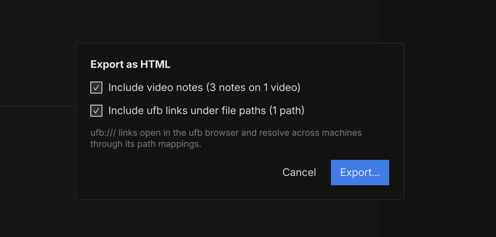
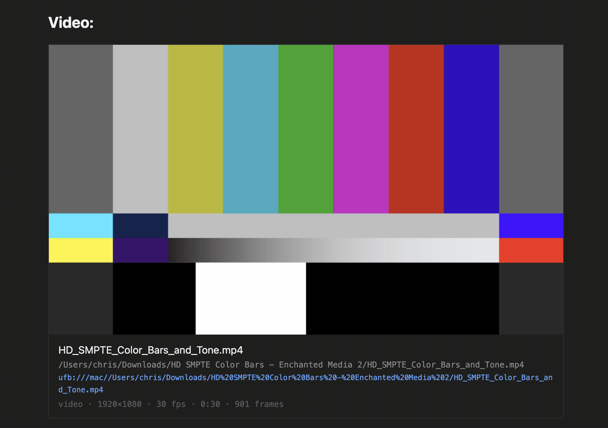

# Export

The **Export** menu writes your note in four formats, plus
[packages](packages.md). Every export leads with the note's name as a
small mono label.

## Formats

- **Markdown** — a portable `.md` plus a `.assets/` folder holding every
  image, sketch render, and video-note thumbnail. Comments become
  footnotes.
- **HTML** — one self-contained file you can send anywhere. Colors,
  highlights, syntax-colored code, and tables survive exactly; the page
  keeps the app's look, wide tables run full width; annotations ride as
  layers behind an **Annotations** toggle; comment threads pop up on
  hover; click any image — table cells and video-note frames included —
  for the built-in lightbox.
- **Word (`.docx`)** — comments arrive as **native Word review
  comments**; code blocks keep their syntax colors; media ink is baked
  into the images; table cells are set in 8pt with tight margins so more copy fits a page.
- **PDF** — print-ready pages with images fitted, tables printed at
  their column widths in smaller type on a hairline grid (a table wider
  than the page continues in column bands, the way a spreadsheet prints
  across pages, with header rows repeated), and annotated PDF pages
  exported as baked images.

[Split rows](editing.md#side-by-side) stay side by side in HTML, Word,
and PDF, at the widths you set; Markdown has no columns, so it stacks the
lanes in reading order.

**Copy as Markdown** (`⇧⌘C`) puts the selection — or the whole note —
on the clipboard in the same Markdown dialect, no files written.

## Export Options

Options appear only when they apply to your note:

- **Include video notes** — QCView-style notes render under each video,
  annotated frames included.
- **Include ufb links** *(off by default, remembered)* — adds a clickable
  `ufb:///` deep link under every file path in the export. Anyone with
  [ufb](https://github.com/cbkow/ufb) installed clicks the link and lands
  on that file in their browser — cross-platform, resolved through ufb's
  own path mappings.

## References

Videos, PDFs, and file attachments export as a poster image plus a
reference card — name, full path, and metadata — so a reader can find the
real file:

Images always collect into the export (sandboxed viewers can't read
absolute paths); videos and other large files stay pointers by design.
