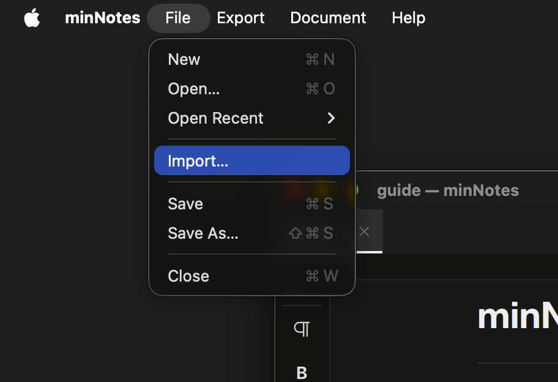

# Import

**File ▸ Import…** — or drop a file on the welcome screen, or drag one
into a note — brings existing material in. A single file becomes a fresh
untitled note (nothing touches disk until you save); an archive of many
becomes a folder of notes.

| Format | Notes |
|---|---|
| Markdown (`.md`) | GFM tables, fenced code with language, tri-state tasks |
| Plain text (`.txt`) | Markdown-style prefixes convert on the way in |
| CSV / TSV | Becomes a table; first row is the header |
| HTML | Headings, lists, formatting, tables, images |
| Word (`.docx`) | Round-trips minNotes' own exports, including comments |
| Excel (`.xlsx`) | Sheets become tables — **including images in cells** (both the floating and place-in-cell kinds) |
| OpenDocument (`.ods` / `.odt`) | Calc sheets → tables; Writer docs with styles, lists, images |
| Source code | 37 languages → one syntax-highlighted code block |
| RTF | macOS only |
| Evernote (`.enex`) | One note per entry; images and attachments come along |
| Notion export (`.zip`) | Every page becomes a note; databases become tables |

Spreadsheet padding (empty rows and columns out to the sheet edge) is
trimmed on the way in, and images referenced by imported documents are
copied into the note's media folder.

> To bring an imported note **into an existing note**, import it to a tab
> and then [drag the tab onto the destination](basics.md) — the whole
> thing merges where you drop it.
