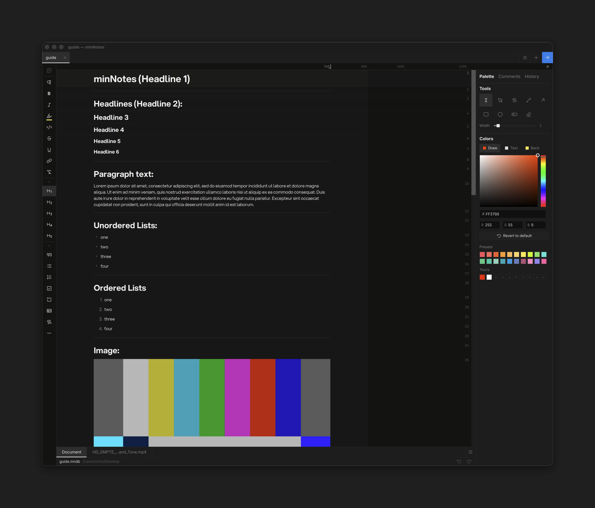
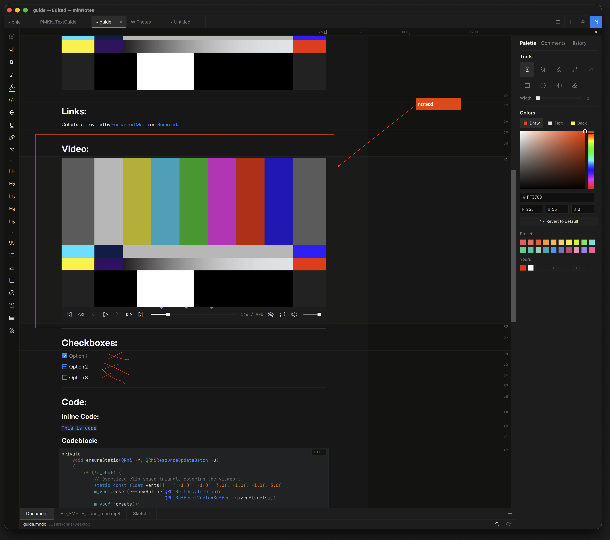

# minNotes
---



**minNotes** is a fast, block-based notes editor for macOS and Windows with rich media support (images, PDFS, videos). It supports basic Markdown syntax for input. Notes are plain SQLite files
(`.mndb`) you can keep anywhere — local disk, a network share, Dropbox,
LucidLink — and open on either platform and dodge some typical file-locking issues with team usage and shared storage.

---

## Key Features

### Writing
- Block editor — paragraphs, headings 1–6, quotes, syntax-highlighted code,
  bullet / numbered / task / choice lists, dividers
- Markdown-style input: type `## `, `- `, `> `, ` ``` ` and the block
  converts as you go
- Inline formatting with text color and background, links, and inline
  choice chips (To do / Doing / Done anywhere in text)
- Per-note page width, from a prose measure to a wide board
- A block-number ruler down the right side — drag a number to reorder,
  reference "block 14" in a review
- Full undo history panel: the note's timeline, click to time-travel

### Tables
- Rich cells with text, formatting, and images; choice and checkmark columns
- Multi-select rows, columns, or cell ranges for bulk operations —
  delete, clear, color, retype, copy-as-table — each a single undo
- Sort, fill down/right, drag-reorder rows and columns
- One-click kanban board view grouped by any choice or check column

### Media & Review
- Inline images, video (scrub, skim audio, annotate — interchangeable with
  [QCView](https://qcview.com)), page-by-page PDFs, file attachments
- Draw anywhere: the armed tool is the mode — page margins, images,
  sketches, video frames, and directly on PDF pages
- Comment threads anchored to text, with margin bubbles and resolve state
- Local files copy into the note's media folder automatically; network
  shares stay referenced in place, with cross-OS path mapping



### Documents
- Multi-document tabs; drag a tab onto another tab to merge whole notes
- Import: Markdown, text, CSV/TSV, HTML, Word, Excel, OpenDocument,
  source code, RTF (macOS), Evernote, Notion
- Export: Markdown + assets, self-contained HTML review page, Word with
  native review comments, print-ready PDF
- Sealed `.mnpkg` packages — one file with every referenced asset inside,
  video plays straight from the archive

---

## Get Going

1. **Download** the latest `.dmg` (macOS) or `.exe` (Windows) from the
   [releases page](https://github.com/cbkow/minNotes/releases/latest) —
   see [Installation](installation.md).
2. Open or create a note, then start with [Documents & Tabs](basics.md)
   and the [Editing](editing.md) primer.
3. Keep the [Keyboard shortcuts](shortcuts.md) close.

minNotes is free software, licensed
[GPL-3.0-or-later](https://github.com/cbkow/minNotes/blob/main/LICENSE).
It runs entirely on your machine — see [Privacy](privacy.md).
