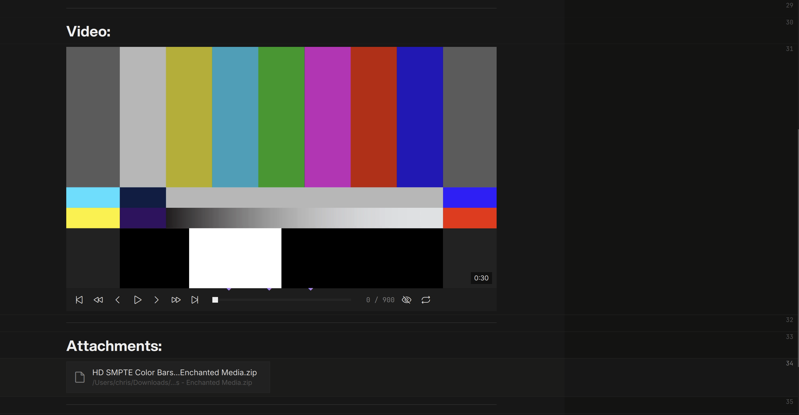
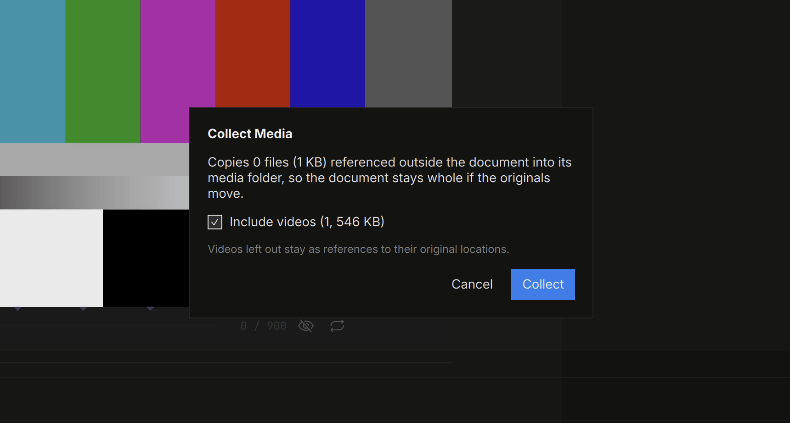
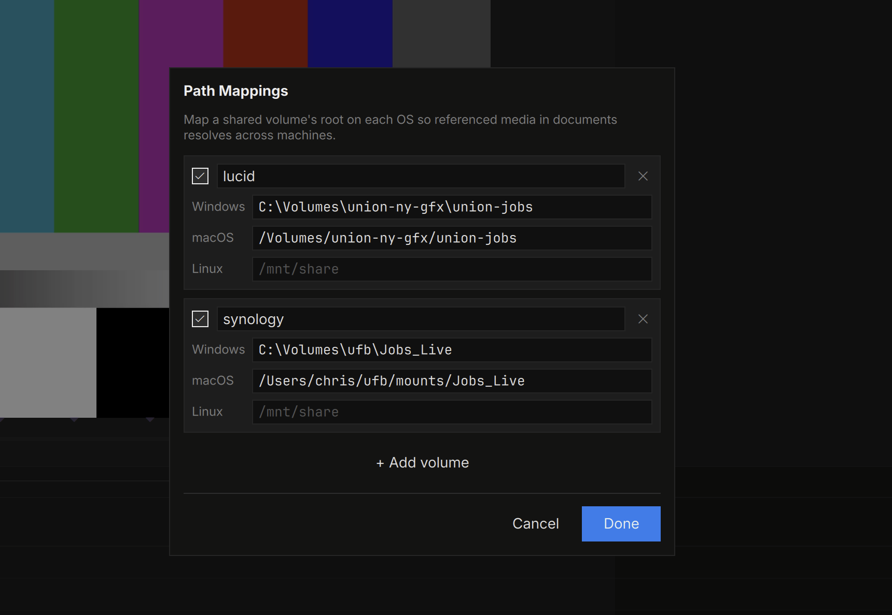

# Media & Files

Drag a file onto the note, or paste from the clipboard:

- **Images** — inline; drag the corner handle to resize (double-click it
  to reset). Images also live inside table cells.
- **Video** — an inline player with a transport bar, skim audio, and
  press-and-hold fast forward / rewind. Open full-frame to scrub and
  annotate — notes are interchangeable with [QCView](https://qcview.com).
- **PDF** — paged inline with prev / next; open full-frame to read, zoom,
  and draw on the pages themselves. The PDF file is never modified.
- **Other files** — an attachment chip; double-click to reveal in Finder /
  Explorer.

## Where Files Live

When you paste or drop a **local** file, minNotes copies it into the
note's own media folder (`.minnotes/` beside the note) — pasted
screenshots can't vanish when a capture app cleans its temp files. Files
on **network shares** stay referenced in place: no duplicate copies of
production media.

**Document ▸ Reveal Media Folder** opens the note's media folder.
**Document ▸ Collect Media…** pulls every externally referenced file into
it (videos opt-in), making the note self-contained — one undo step, and
the note saves itself after.

## Cross-OS Paths

Referenced media is stored as an OS-neutral reference, so a note written
on macOS resolves its NAS paths on Windows and back. Teach minNotes your
share roots once under **File ▸ Path Mappings…**:

| macOS | Windows |
|---|---|
| `/Volumes/projects` | `P:` or `\\server\projects` |

The same mapping system powers [ufb links in exports](export.md).
