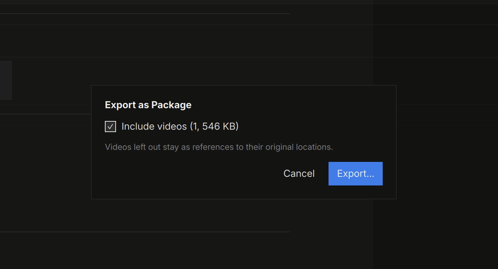

# Packages

A **package** (`.mnpkg`) is a sealed snapshot of a note with every
referenced file inside — one file to archive, or to hand to someone who
doesn't have your network mounts.

## Exporting

**Export ▸ Export as Package…** embeds the note and all its media.
Videos are included by default (the dialog shows what they weigh; leave
them out and they stay as references to their original locations).

Large packages assemble in the background with progress and cancel —
there's no size cap, and video is stored uncompressed so packing is fast
and playback works in place.

## Opening

Double-click a `.mnpkg` and it opens **instantly** as a read-only view —
media loads lazily out of the archive, and video plays straight from it
without extraction.

Packages are snapshots: you can type in the view, but **Save is
disabled** — use **Save As** to materialize an editable `.mndb` copy
(with its media folder) wherever you want it. The package on disk is
never modified.

> The rule of thumb: `.mndb` is the source you work in; `.mnpkg` is the
> artifact you send.
