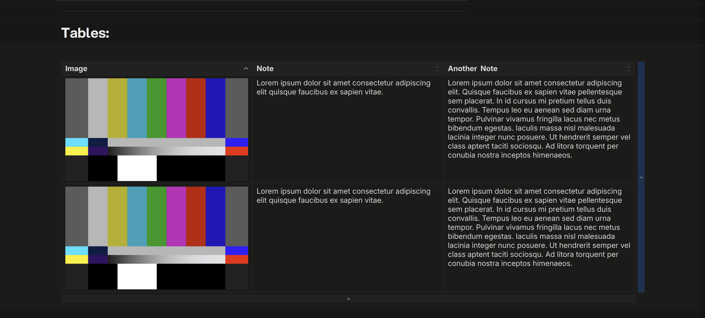
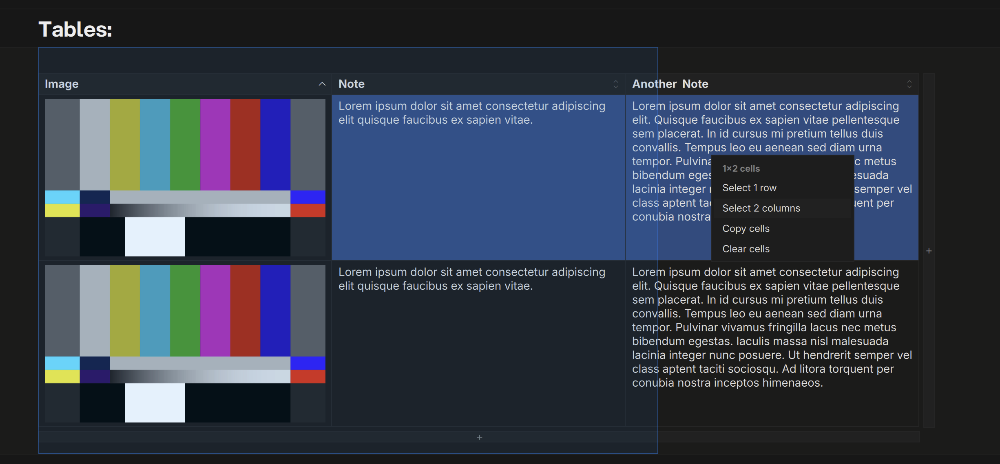
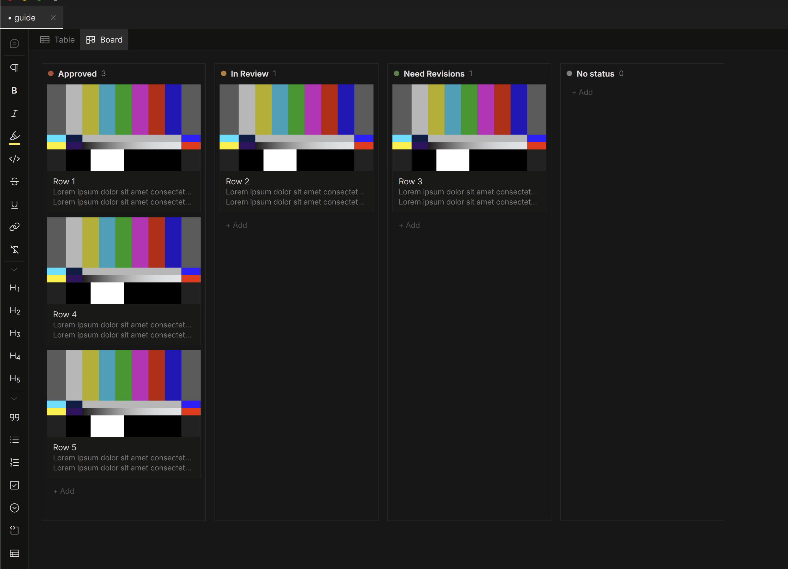

# Tables & Kanban

Insert a table from the block menu, or paste tab-separated text (a
spreadsheet selection pastes straight in). Cells take rich text and
images. Wide tables extend past the page rather than squeezing.

## Columns

Right-click any cell for the column menu:

| Column type | What it does |
|---|---|
| Text | The default — rich text and images |
| Choice | Single-select options with colors (edit the set via **Edit options…**) |
| Checkmark | Tri-state task per cell: to-do / doing / done |

The same menu inserts, moves, duplicates, aligns, and deletes columns and
rows, and sorts the body by a column (click the sort glyph at the right
edge of a header cell for the same thing).

## Selection

- **Click** a cell to edit it; **drag** across cells for a rectangle;
  `Shift+Click` extends it. Inside a cell, drag or `Shift+Click` selects
  text; double-click selects a word.
- **Grip handles** appear when you hover just above a column or left of a
  row — click to select the whole column or row, **drag to reorder** it.
- `Shift+Click` a grip selects a span of rows or columns;
  `⌘Click` a grip adds or removes one from the selection.
- Grabbed a block of cells? Right-click offers **Select N rows** /
  **Select N columns** to promote the rectangle.
- `⌘A` selects every cell; `Esc` steps the selection back out.

## Bulk Operations

Right-click inside a multi-selection for a focused menu:

- **Delete** / **Clear contents** / **Copy as table** for the selected
  rows or columns
- **Align** and **column type** changes across every selected column
- Palette colors apply to the whole selection — row and column sets color
  as a unit, so new cells in those rows inherit it

Every bulk operation is a **single undo**.

| Action | Shortcut |
|---|---|
| Copy selection (TSV + table) | `⌘C` |
| Clear selection contents | `Backspace` |
| Fill selection down / right | `⌘D` / `⌘R` |

Deleting rows or columns is menu-only, on purpose.

## Board View

Any choice or checkmark column can become a **kanban board**: right-click
the column → **View as board**. Cards are the table's rows; drag a card
between lanes to change its value (and reorder). Double-click a card to
jump back to its row in the grid.

